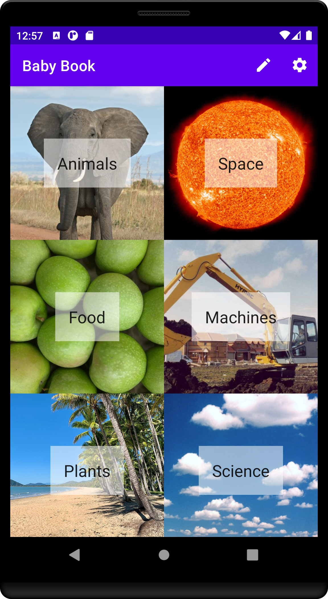
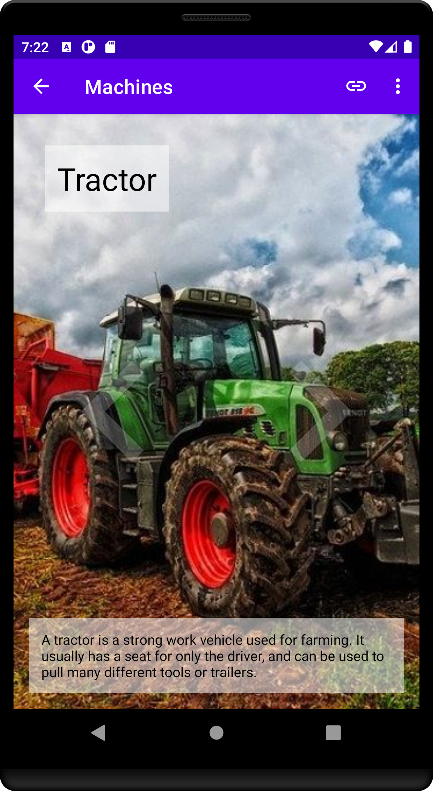
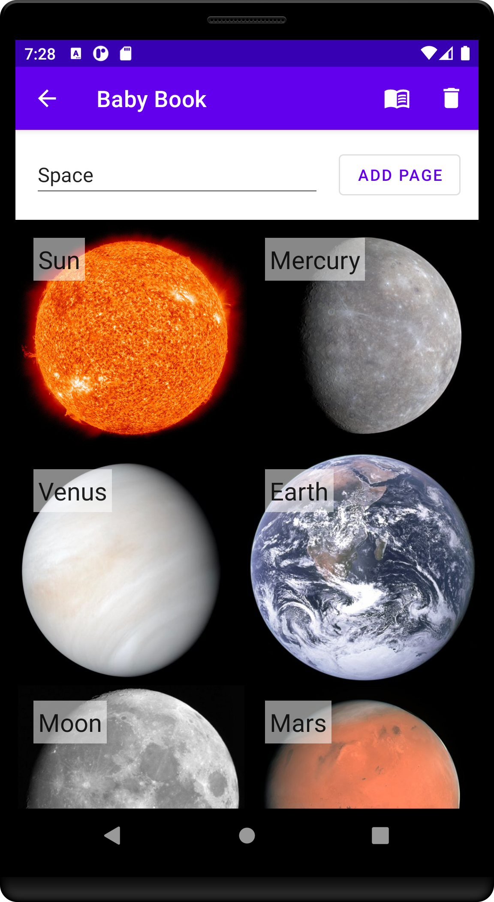
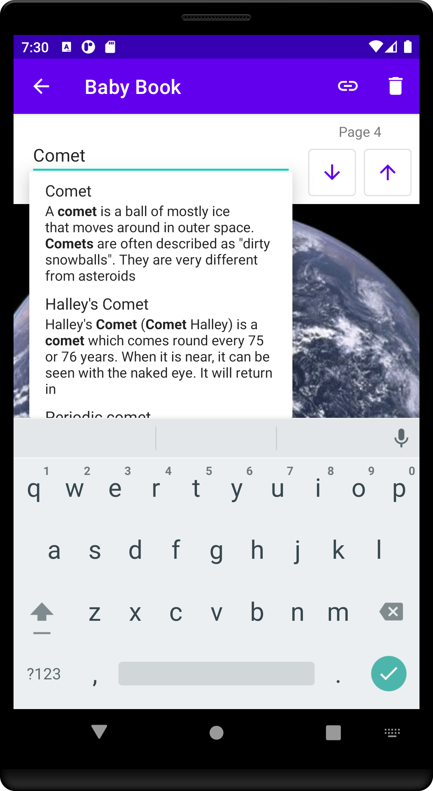

# Baby Book

Baby Book is an Android app and a website for creating books to help (you and) your growing child learn.

   

## Contributing

### Donations

Baby Book is an open source, GPLv3 application. It will always be freely available via F-Droid, or for anyone to build, fork, or improve via the source code.

If you wish to support the development financially, you can do so via:

* [Liberapay](https://liberapay.com/BabyDots/donate)
* [GitHub sponsors](https://github.com/sponsors/pserwylo)

### Reporting Issues

Please report any issues or suggest features on the [issue tracker](https://github.com/babydots/babybook/issues).

### Submitting changes

Pull requests will be warmly received at [https://github.com/babydots/babybook](https://github.com/babydots/babybook).

## Compiling

This app uses a typical `gradle` folder structure and is written in Kotlin.

 * To build the Android app (a debug version): `gradle assembleDebug`
 * To build the web app: `...`

Alternatively, you can import the project into Android Studio and build from there.

## LICENSE

This program is Free Software: You can use, study share and improve it at your will. Specifically you can redistribute and/or modify it under the terms of the [GNU General Public License](https://www.gnu.org/licenses/gpl.html) as published by the Free Software Foundation, either version 3 of the License, or (at your option) any later version.
